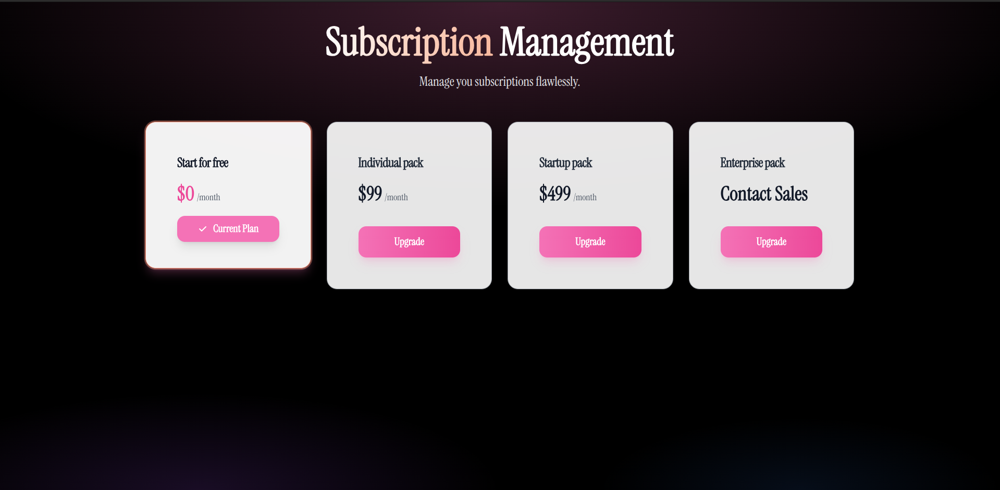

# 🧩 Machine Coding – Subscription Management (React + TypeScript)

This is a frontend machine coding assignment to implement a **Subscription Plan Management** UI using React.js and TypeScript.

---

## 🚀 Demo



> 🎥[watch the full demo](https://youtu.be/imtnn2asWYo)

---

## 🛠 Tech Stack

- **React.js**
- **TypeScript**
- **Vite**
- **Tailwind CSS (ShadCN UI)**
- **Framer Motion**

---

## 📦 Local Setup

Clone the repo and run:

```bash
npm install            # Install dependencies
npm run start:server   # Start mock backend server
npm run dev:app        # Start React frontend
```
